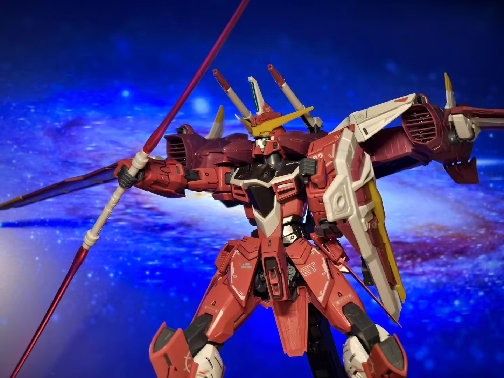
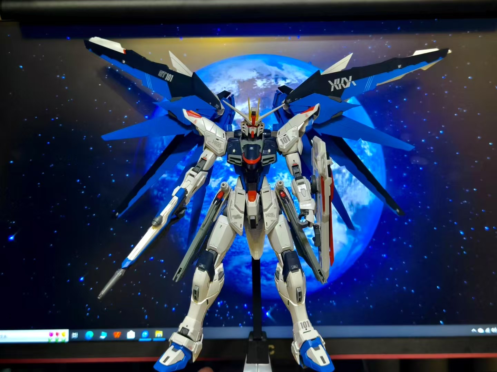
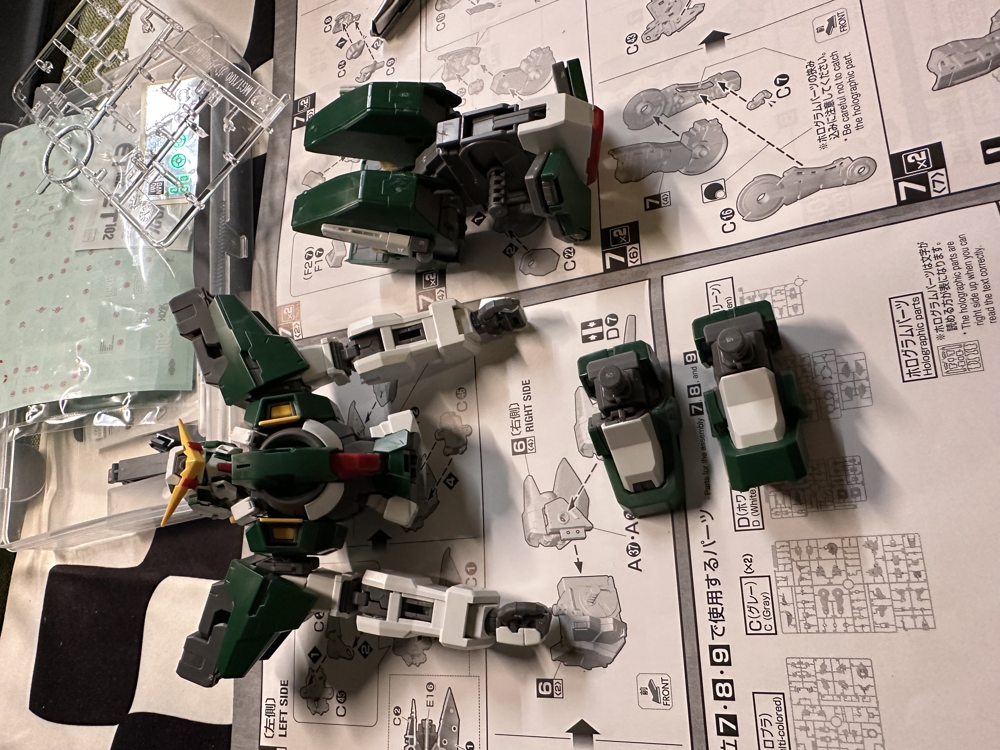

Watching animation has been one of my favorite pastimes for years. I’m drawn to the rich stories, imaginative worlds, and unique artistic styles that anime offers. Whether it’s a classic series or a new seasonal release, animation inspires me with its creativity and emotional depth.

Alongside this, I also enjoy assembling Gundam model kits—also known as Gunpla. It’s a satisfying and hands-on hobby that brings the mecha designs I admire on screen into the real world. From carefully snapping parts together to applying decals and fine details, the process is both relaxing and rewarding.

Together, these hobbies allow me to connect with a vibrant creative culture while also giving me space to unwind and focus. Each completed model and favorite anime episode adds to a growing collection of stories and memories I deeply enjoy.

