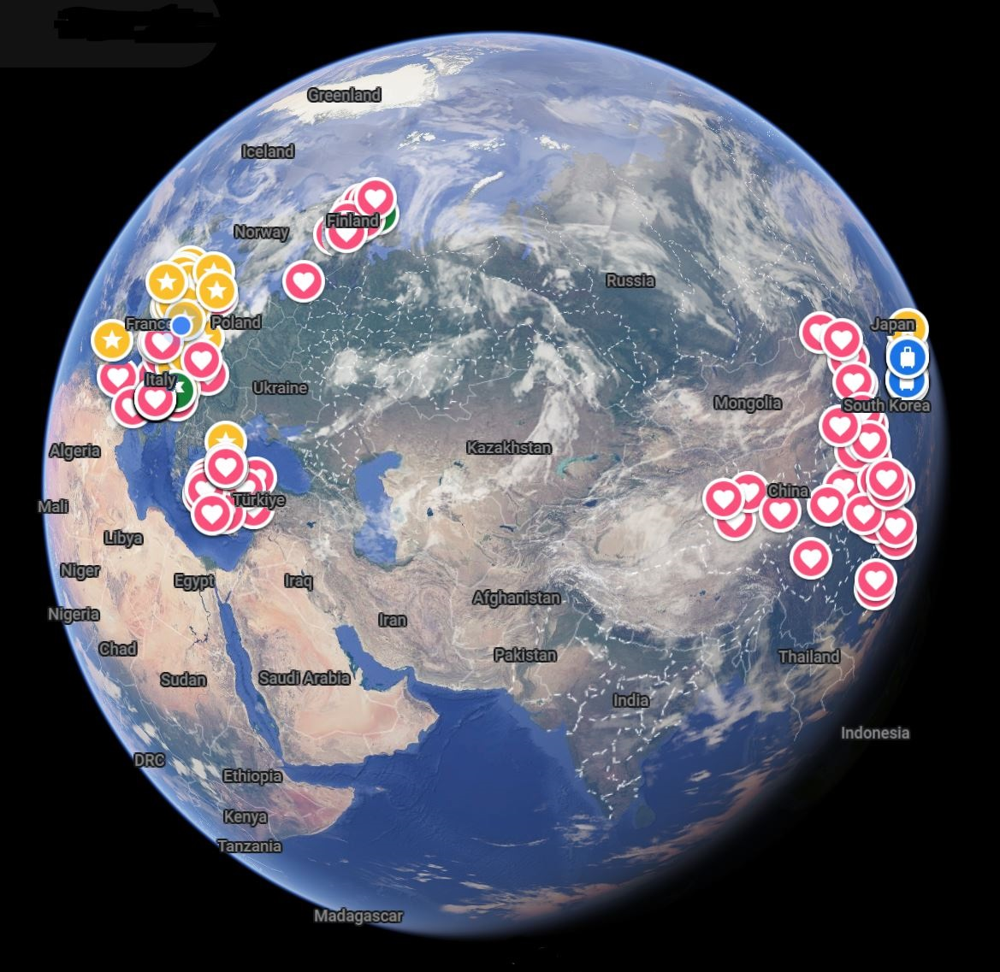
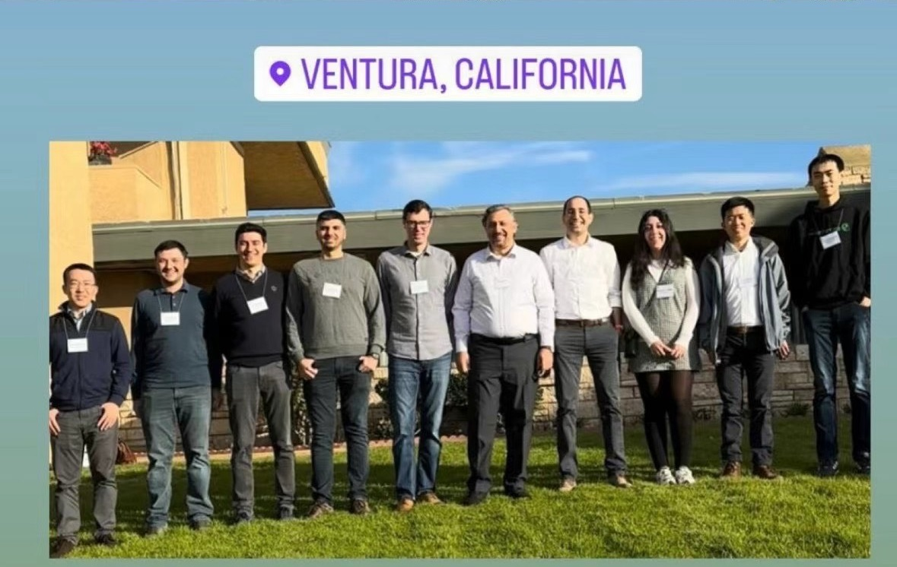
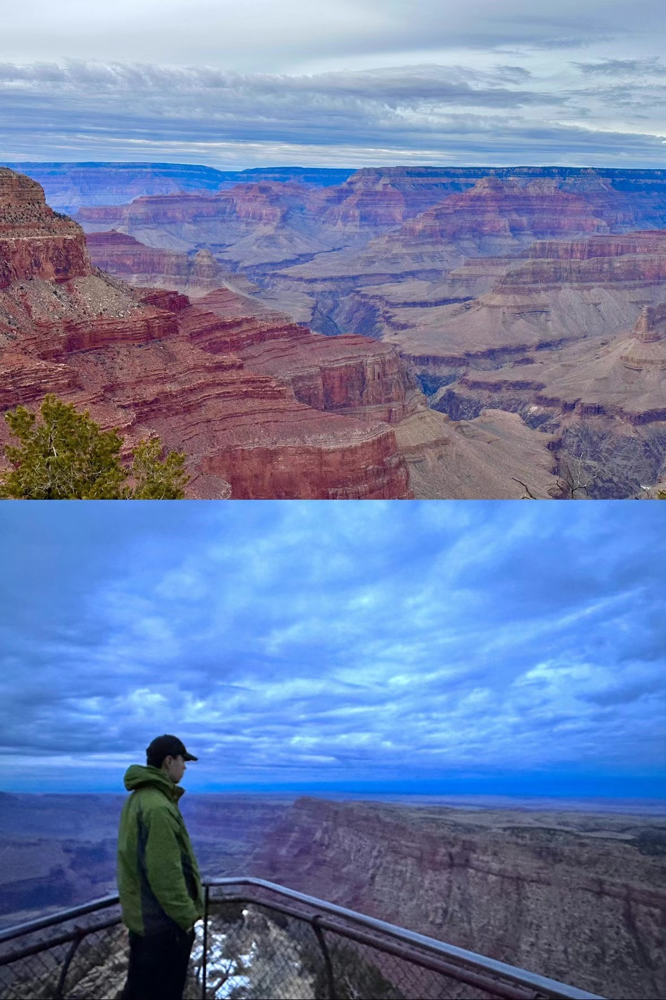

Exploring the World

Traveling has always been a source of inspiration and growth for me. Over the years, I’ve visited numerous countries across Asia, Europe, and beyond—each destination offering its own unique charm, traditions, and stories.

What I love most about traveling is the opportunity to step out of the familiar and immerse myself in new environments. From bustling cities to serene natural wonders, every place I've explored has left a lasting impression and taught me something valuable—whether it's a local custom, a new cuisine, or a different way of thinking.

These experiences have not only broadened my worldview but also shaped who I am today. I believe that every journey, big or small, adds a new layer to our understanding of the world and ourselves.

