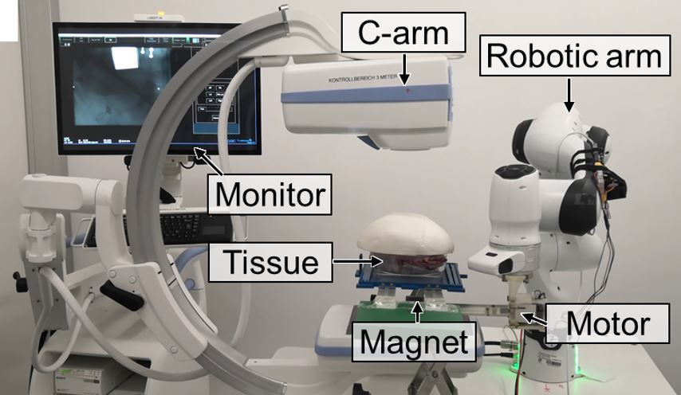

The paper presents **MicroSyn-X**, a framework addressing real-time tracking and robotic deployment of miniature medical devices (MMDs) under X-ray guidance. Key techniques include:

* **Synthetic Data Generation**: Uses diffusion models (e.g., pix2pix stable diffusion) to create high-fidelity X-ray images with pixel-accurate labels, integrating user-defined masks and domain randomization (e.g., varying tissue types, noise levels, robot shapes) to mimic clinical scenarios without manual annotation.
* **CV Model Training**: Employs YOLO11-seg for real-time detection/segmentation, using patch-based strategies and data augmentation (geometric/color transformations) to enhance small-object detection in low-contrast, noisy environments.

* **Robotic System Integration**: Combines a 7-DOF robotic arm with magnetic actuation and C-arm fluoroscopy, using adaptive Kalman filtering for tracking and path planning based on preoperative CT/angiography data.
* **Validation**: Demonstrates robustness in *ex vivo* (porcine tissues) and *in vivo* (rabbit/rat models) environments, with an open-sourced X-ray MMD dataset for benchmarking.

MicroSyn-X bridges data scarcity and enables precision interventions via synthetic data-driven automation, outperforming real-data-trained models in challenging imaging conditions.

> This work is under submission.