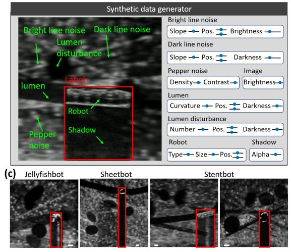
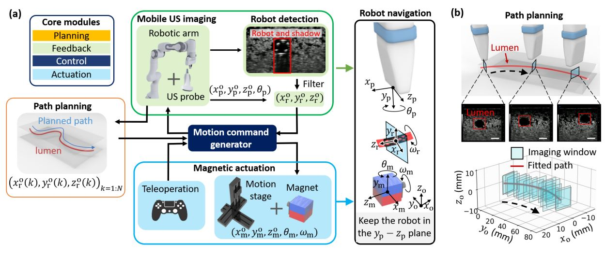

# Techniques and Expertise Summary of "Synthetic Data-Assisted Miniature Medical Robot Navigation via Ultrasound Imaging"

---

## 1. **Synthetic Data-Generated Deep Learning for Robot Detection**
- **Challenge Addressed**: Shortage of medical imaging data and high manual labeling costs.
- **Technique**:
  - A combination of synthetic data and real data from synthetic materials is used to train a neural network (YOLOv5s CNN model) to detect robots in noisy ultrasound images.
  - Synthetic data generation includes simulating background noise, lumen interference, robot shadows, and pepper noise to enhance model generalization.
  - Utilizes domain randomization to vary imaging parameters (e.g., lighting, pose) and reduce overfitting.
- **Advantages**: Reduces human-labeled data usage by 85% (e.g., 100 real + 800 synthetic images vs. 600 real images) while maintaining detection accuracy.

---

## 2. **Ultrasound Imaging-Guided Robotic Navigation System**

- **System Components**:
  - **Path Planning**: Extracts lumen geometry via ultrasound scanning and uses the A* algorithm with 3rd-order spline interpolation to generate robot and ultrasound probe paths.
  - **Magnetic Actuation**: Controls magnetic soft millirobots (e.g., stentbot, jellyfishbot) using a rotating/translating permanent magnet, leveraging magnetic torque and force for locomotion.
  - **Real-Time Tracking**:
    - Ultrasound probe (mounted on a 7-DOF robotic arm) automatically follows the robot to maintain it within the imaging plane.
    - Implements a "tracking-via-searching" algorithm to recover lost robots by scanning ±10 mm along the lumen path.
- **Coordinate Frames**: Defines global, magnet, probe, and robot frames to enable precise motion coordination.



---

## 3. **Key Innovations and Validation**
- **Hybrid Data Training**: Demonstrates that synthetic data improves model performance on ex-vivo tissues (e.g., chicken breast, porcine heart arteries), outperforming pure real-data training in low-contrast and occluded scenarios.
- **Multi-Robot Generalization**: Successfully detects robots with varying sizes (0.5–1.5 mm) and unseen objects (microcatheters) using the same framework.
- **Experimental Validation**:
  - Achieves real-time navigation in tortuous lumens (agarose gel phantoms) with an average speed of 0.7 mm/s.
  - Processes ultrasound images at 51.5 FPS using a standard GPU, enabling near-real-time feedback.

---

## 4. **Clinical Relevance and Future Work**
- **Safety Features**: Robot design includes shape adaptation for lumen diameter changes and self-anchoring to resist blood flow.
- **Challenges Addressed**: Overcomes limitations of Doppler-based tracking (requires robot motion) and filter-based methods (struggle in complex environments).
- **Future Directions**:
  - Integrate motion-aware control for dynamic biological environments (e.g., blood flow, respiration).
  - Improve localization accuracy via multi-feature fusion (shadow + Doppler signals) and high-resolution ultrasound probes.
  - Develop force-controlled ultrasound scanning for safe tissue interaction.

---

## 5. **Hardware and Software Setup**
- **Hardware**:
  - **Ultrasound**: Vevo 3100/MX550 probe on a 7-DOF Franka Emika robotic arm.
  - **Magnetic Actuation**: 5-DOF motion stage with a 20 mm cubic magnet.
- **Software**:
  - ROS Noetic framework for real-time control and communication.
  - YOLOv5s for object detection, trained with synthetic data via custom Python generators.

This work presents a robust framework for minimally invasive robotics, combining synthetic data-driven AI with autonomous navigation to enable safe and efficient deployment of miniature robots in complex biological environments.
 > This work is in press.