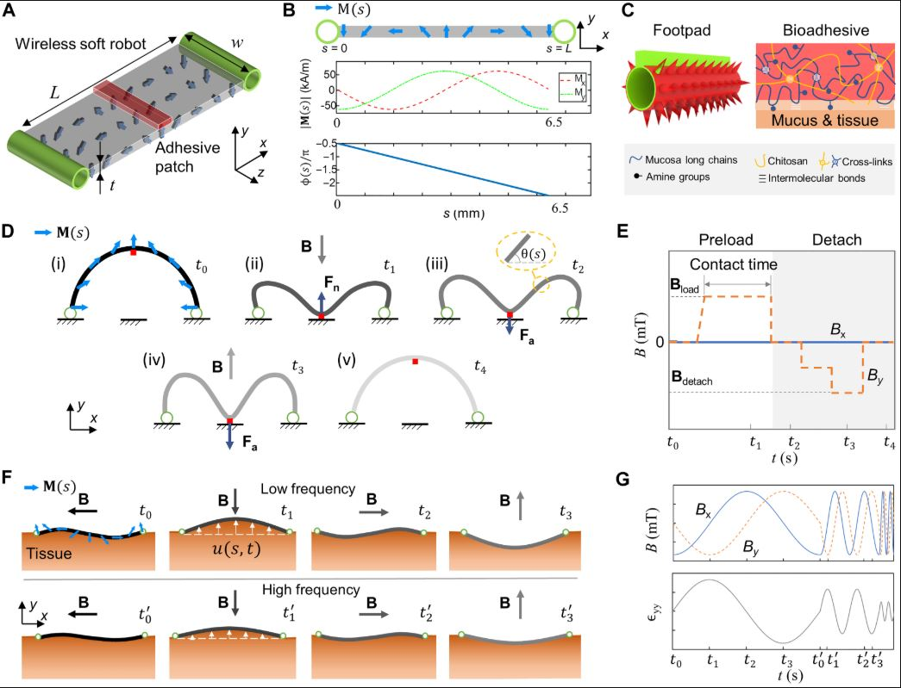
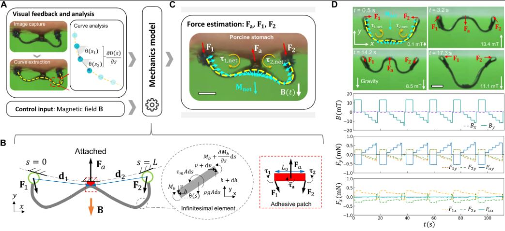
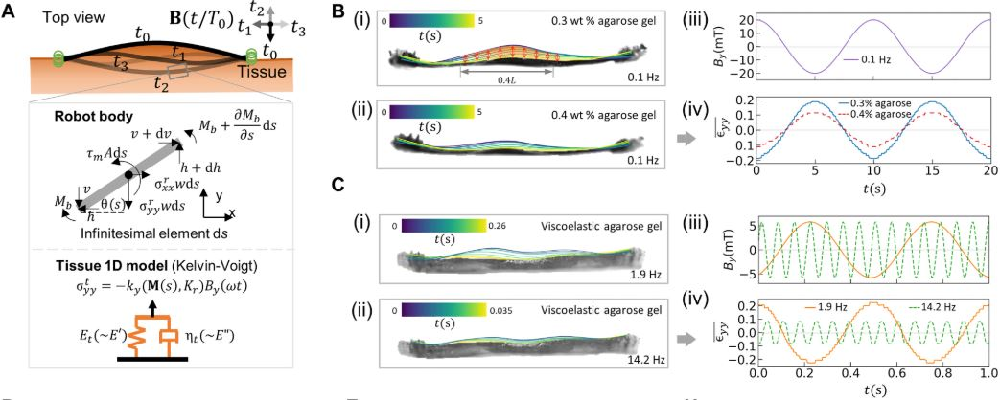
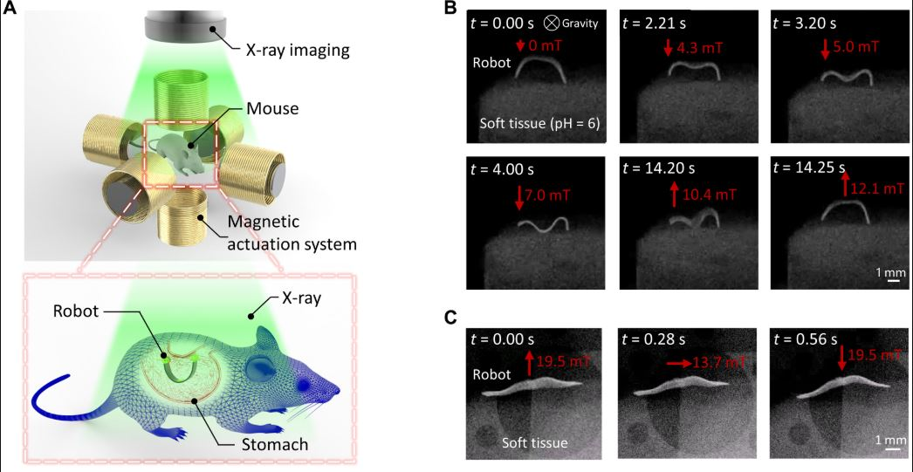
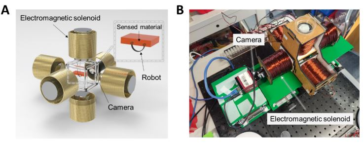
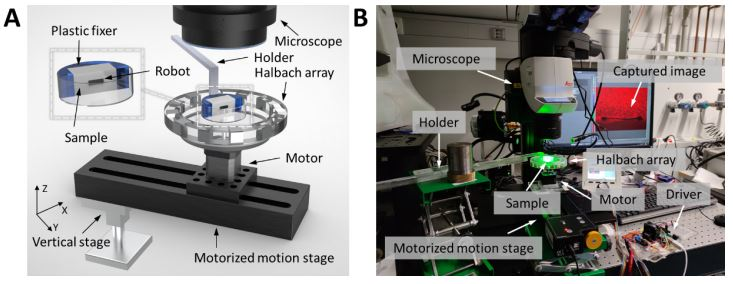

---
### Interdisciplinary Expertise

* **Soft Robotics:** Design of magnetically actuated, bioadhesive-enabled microdevices.
* **Biomechanics:** Analysis of tissue-robot interactions using beam theory and viscoelastic models.
* **Image processing:** Robot shape extraction and analysis.
* **Medical Imaging:** Integration of X-ray/ultrasound with real-time robotic sensing.
* **Materials Science:** Development of pH-responsive hydrogels and biocompatible adhesives.
-------

### 1. Wireless Miniature Soft Robot Design and Actuation

* **Magnetoelastic Soft Body:** The robot is made from **Ecoflex silicone rubber** mixed with **NdFeB microparticles** for magnetic responsiveness. It features **ring-shaped footpads with microspikes** and **chitosan-based bioadhesive patches** for controlled tissue attachment.
* **Multimodal Locomotion:** A customized **Halbach array** generates external magnetic fields, enabling versatile movements like walking, climbing, crawling, and swimming for navigation in complex tissues.
* **Magnetic Control:** **Static magnetic fields** induce buckling for adhesion and pH sensing, while **rotating magnetic fields** (0.1–15 Hz) enable dynamic deformation for viscoelasticity sensing.

---
### 2. Sensing Mechanisms for Tissue Properties

#### Static Interaction (Adhesion and pH Sensing)

* **Buckling-Based Adhesion Sensing:** The robot's buckling motion under magnetic fields is modeled using **Euler-Bernoulli beam theory**. Analyzing the threshold magnetic field for detachment quantifies tissue adhesion.
* **pH-Responsive Adhesive Patch:** A three-layer patch (elastomer, hydrogel, pH-sensitive bioadhesive) uses **catechol-boronate complexation** for pH-dependent adhesion. Adhesion strength correlates linearly with pH (sensing range: pH 1–8, sensitivity: 1 pH unit).

#### Dynamic Interaction (Viscoelasticity Sensing)

* **Frequency Sweeping Method:** Rotating magnetic fields induce periodic robot deformations. Analyzing the frequency response of tissue strain ($\epsilon_{yy}$) relative to magnetic field amplitude allows estimation of **storage modulus ($E'$) and loss modulus ($E''$)** using a magnetoelastic model.
* **Mechanical Calibration:** Synthetic materials like agarose and gelatin gels are used to calibrate the relationship between $\epsilon_{yy}/B_y$ and $E'$, with relative errors less than 8% for $E'$ and less than 12% for $E''$.

---
### 3. Medical Imaging and Data Analysis

* **X-Ray and Ultrasound Imaging:** Real-time imaging (30 FPS for X-ray) tracks robot shape changes. X-ray provides high contrast, with a radiation dose less than 410 $\mu$Sv/hour (safe for in vivo use).
* **Image Processing:** Robot edges are extracted, and centerlines are fitted with **B-splines**. **Digital image correlation (DIC)** analyzes tissue displacement fields to compute strain.

---
### 4. Biomechanical Modeling and Validation

* **Magneto-Mechanical Model:** The robot-tissue interaction is modeled using **distributed magnetic torque and force balance equations**. Adhesion force ($F_a$) and viscoelastic parameters are derived from robot geometry and magnetic inputs.
* **Ex Vivo Validation:** Tests on porcine and murine gastrointestinal tissues (stomach, small intestine, colon) validate sensing accuracy. For example, adhesion errors on mouse stomach tissues are less than 10%, and viscoelastic moduli align with rheometer measurements.

---
### 5. Biomedical Applications and Translational Expertise

* **Disease Modeling:** The robot differentiates healthy and diseased tissues (e.g., TNK1-expression mice with impaired intestinal barriers) by detecting pH and viscoelasticity changes.
* **Minimally Invasive Design:** The robot's millimeter-scale size (6.5 mm $\times$ 2 mm $\times$ 15 mm) and untethered locomotion allow access to confined spaces with minimal invasion, avoiding surgical implantation.
* **Biocompatibility:** Surface coatings (PDMS, parylene C) prevent toxic particle exposure; future cell viability tests are planned.
> For more details, refer to "Wang, Chunxiang, et al. "In situ sensing physiological properties of biological tissues using wireless miniature soft robots." Science advances 9.23 (2023): eadg3988."