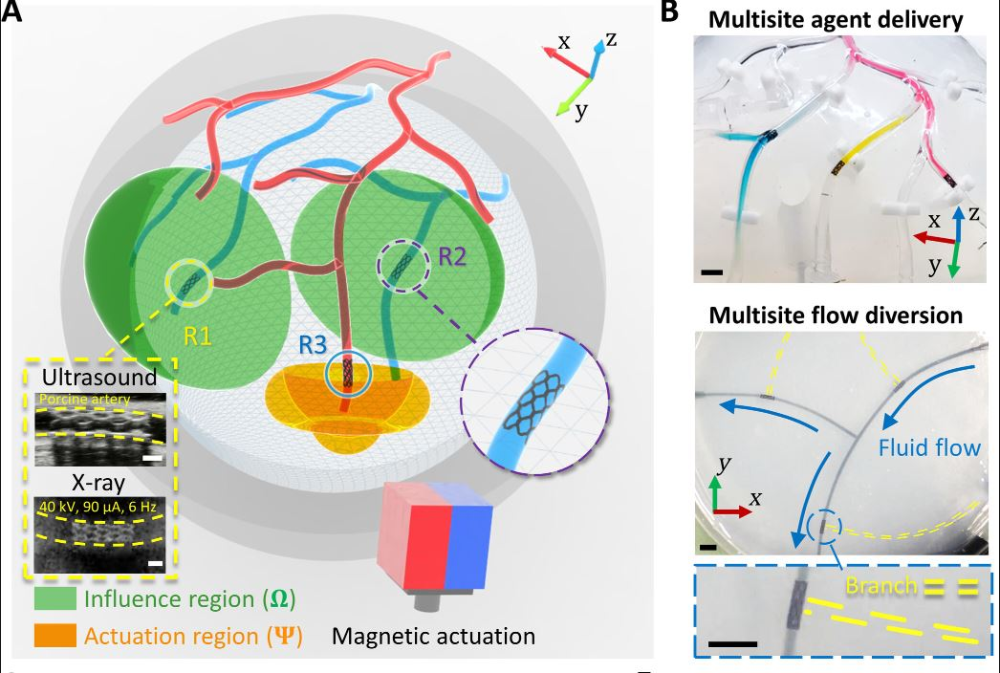
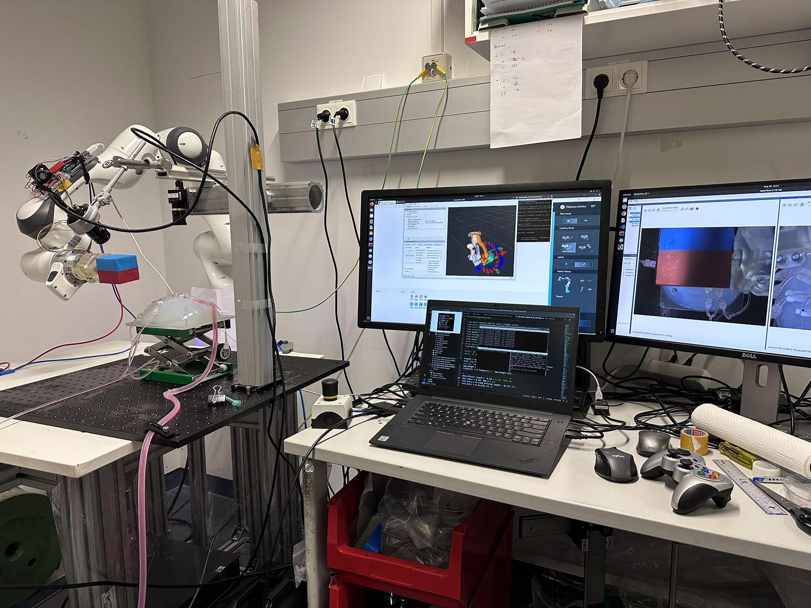
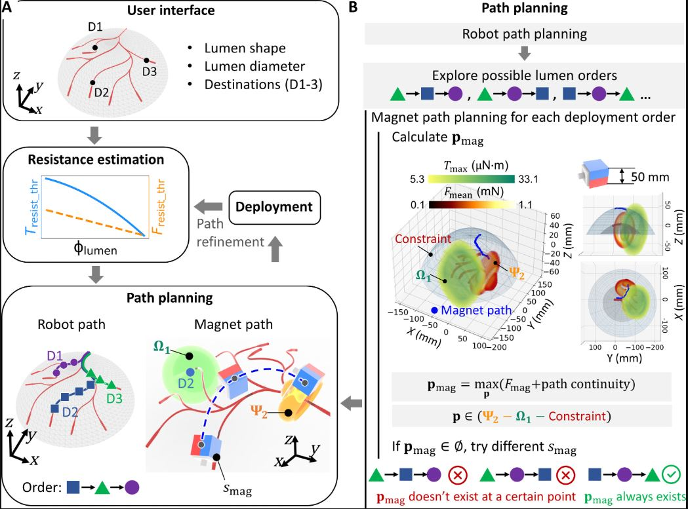
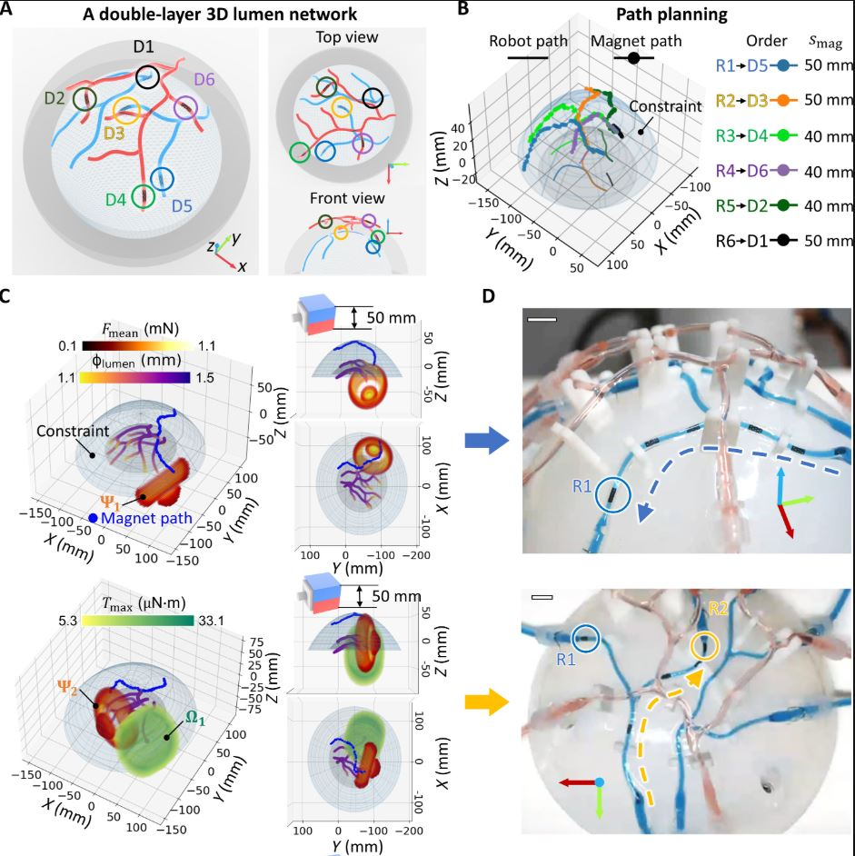
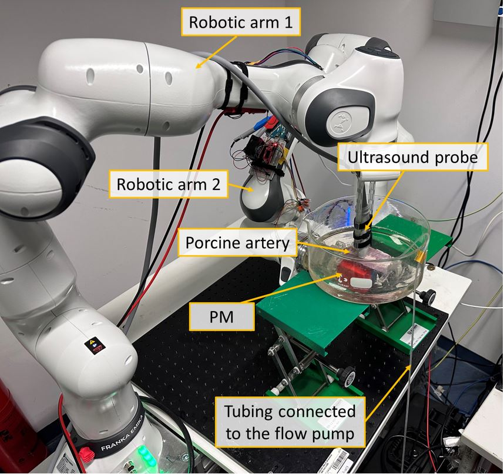
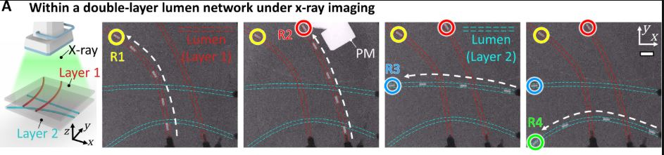
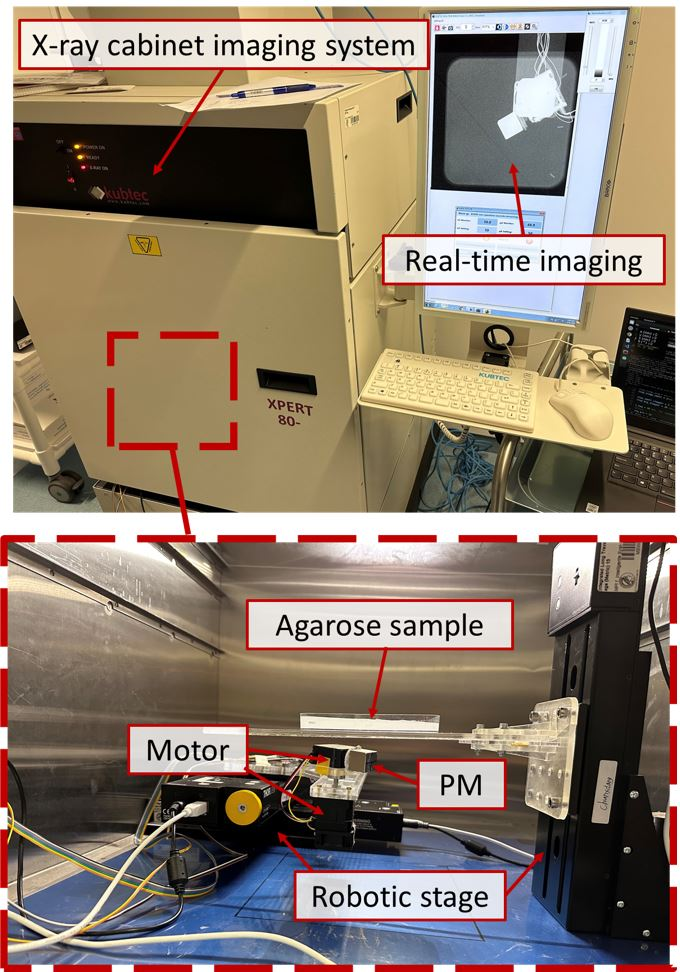

---
### Interdisciplinary Expertise

* **Soft Robotics:** Design and fabrication of shape-adaptive, stent-structured magnetic soft robots with self-anchoring capability for tortuous 3D lumen navigation.
* **Mechanics:** Analysis of robot-lumen interaction resistance and the complex magnetic field generated by a rotating permanent magnet..
* **Control Engineering:** Development of path planning algorithms for permanent magnet trajectories to ensure sequential multirobot navigation while avoiding interference between deployed robots.
* **Medical Imaging:** Integration of real-time ultrasound and X-ray imaging for supervised autonomous navigation and localization of robots in 3D lumens.
* **Robotic systems:** Dual-arm robotic system for ultrasound tracking and magnetic actuation.
* **Materials Science:** Utilization of polymers for soft robot fabrication.
-------

---
### 1. Robot Design and Actuation

* **Shape-Adaptive Stent-Structured Robots:** The robots are designed to be shape-adaptive, allowing navigation through tortuous 3D lumens with a self-anchoring capability to withstand fluid flow. They are constructed from soft materials, ensuring safe biomedical interactions and enabling resistance variation through deformation.
* **Magnetic Actuation with Permanent Magnet (PM):** A translating and rotating permanent magnet (PM) mounted on a 7-degrees-of-freedom (DOF) robotic arm is used for actuation. This method offers advantages such as compactness, heat-free operation, and scalability for human-scale applications, differentiating it from electromagnetic actuation.

---
### 2. Control Strategy: Influence and Actuation Regions

* **Key Concepts:** The framework introduces two critical regions for quantifying robot movement: the **Influence Region ($\Omega$)**, where the PM induces sufficient torque for robot rotation, and the **Actuation Region ($\Psi$)**, a subset of $\Omega$ where both torque and force exceed resistance thresholds, enabling continuous rotation and translation.
* **Independent Control Mechanism:** Independent control is achieved by strategically positioning the PM within the $\Psi$ of the target robot while ensuring it remains outside the $\Omega$ of already deployed robots to prevent interference. The size and shape of these regions ($\Omega/\Psi$) can be dynamically adjusted based on factors like PM size and orientation, lumen diameter, material stiffness, and fluid flow.

---
### 3. Resistance Estimation and Path Planning

* **Online Resistance Estimation:** The study details a method for online estimation of resistive torque ($T_{resist_{thr}}$) and force ($F_{resist_{thr}}$) at critical points of robot movement initiation. This involves quantifying resistance based on the magnetic torque and force required to overcome local friction and fluid drag.
* **Path Planning Algorithm:** A path planning algorithm generates the trajectory of the permanent magnet for multirobot navigation through complex 3D lumen networks. It optimizes the deployment order to avoid interference with deployed robots and maximize actuation force on the target robot.

---
### 4. Experimental Validation

* **Multilayer 3D Lumen Deployment:** The system's efficacy was demonstrated by deploying up to six robots in synthetic and *ex vivo* porcine artery lumens under ultrasound and X-ray imaging, even in dynamic fluid environments with pulsatile flow.
* **Functional Demonstrations:** The framework's potential was showcased through demonstrations of multi-location cargo delivery using robots with PDMS patches and flow diversion by blocking branch lumens with sealed stent cells.

---
### 5. Biomedical Applications and Innovations

* **Advantages Over Single-Robot Systems:** The multirobot system allows for the simultaneous execution of tasks at multiple sites, which enhances efficiency and reduces operation time compared to sequential single-robot procedures.
* **Integration with Medical Imaging:** Real-time monitoring and guided navigation are facilitated by the integration of medical imaging techniques such as ultrasound and X-ray.

---
### 6. Materials Science and Medical Imaging Expertise

* **Materials Science:** Expertise in material science is evident in the fabrication of the soft robots, including the use of silicone rubber and NdFeB microparticles for magnetic responsiveness (as detailed in the earlier summary), as well as the preparation of synthetic lumen materials like PDMS and agarose gel.
* **Medical Imaging:** The work demonstrates expertise in utilizing real-time medical imaging, specifically ultrasound and X-ray imaging, for tracking robot shape changes, guiding navigation, and validating experiments in complex biological environments.

